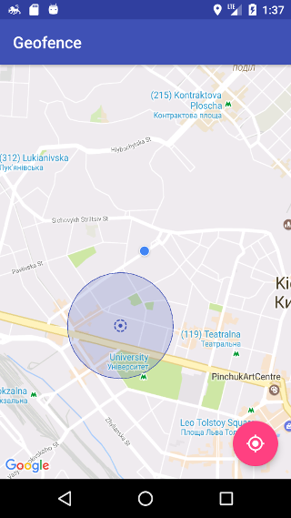
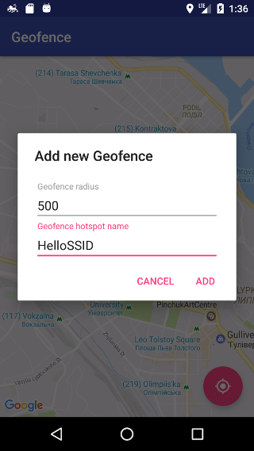
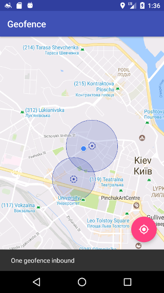
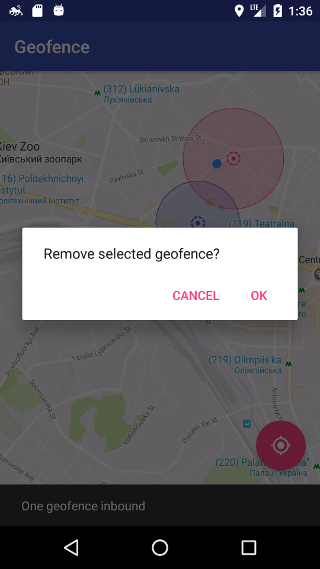

Geofence
===================

Geofence detects if device is inside of geofence area.
Geofence area is defined as a combination of some geographic point, radius, and Wi-Fi network name. Device is considered to be inside of the geofence zone if it’s connected to the specified network or remains geographically in the defined circle.

## Project structure
* [core](core) is Java library. It contains geofence detection module which is self-written solution to meet requirements and have full control on most important part of project (business logic). It partially covered by JUnit tests.
* [app](app) is Android application. It holds Android implemented for providers used by geofence detector:
    - [AndroidLocationProvider](app/src/main/java/com/github/stevenrudenko/geofence/core/AndroidLocationProvider.java) handles Location updates using Google fuzed-location solution
    - [AndroidWifiInfoProvider](app/src/main/java/com/github/stevenrudenko/geofence/core/AndroidWifiInfoProvider.java) reads WiFi state and SSID
    - [SqliteGeofenceStorage](app/src/main/java/com/github/stevenrudenko/geofence/core/SqliteGeofenceStorage.java) is used to persist list of Geofences

## Usage

#### Geofence indicator
Message slides from bottom of screen when device goes in or out geofence area. It shows number of geofence areas device inbounds.

#### Adding geofence area
To add geofence area long-press on map at place where geofence area center should be. Dialog will appear to set area radius and hotspot SSID pattern. Radius is mandatory to be set. SSID pattern is optional.

Please note that SSID pattern should be compilable [RegEx](https://en.wikipedia.org/wiki/Regular_expression) pattern. It used to support situation when facility has hotspots with different names. For example when hotel has different hotspots for different levels (like `Hotel`, `Hotel-05`, `Hotel_200-230` etc.) In examples case SSID pattern would be: `Hotel[-_\d]*`

#### Removing geofence area
Click on geofence area center to select it to be removed. Confirmation dialog will appear to delete selected geofence area.

## Feature to be implemented in future
* Play services error handing
* Handle edge cases with location updates reading (related to Google fuzed-location)
* Add background work support using service
* Add settings page to setup location updates intervals
* Write some more tests
* Texting should be reviewed and fixed

## Limitations
Current code base doesn't support release builds as far release keystore hash should be registered at [Developers console](https://console.developers.google.com/) and put into [google_maps_api.xml]([SqliteGeofenceStorage](app/src/release/res/values/google_maps_api.xml) resource file.

## Features and libraries
* [Support libraries](https://developer.android.com/topic/libraries/support-library/index.html)
* [Google Maps](https://developers.google.com/maps/documentation/android-api/)
* [SQLBrite](https://github.com/square/sqlbrite)
* [RxJava](https://github.com/ReactiveX/RxJava) / [RxAndroid](https://github.com/ReactiveX/RxAndroid) / [RxInrerop](https://github.com/akarnokd/RxJava2Interop)
* [Mockito](https://github.com/mockito/mockito)
* [JUnit4](https://github.com/junit-team/junit)
* [Kotlin](http://kotlinlang.org/)


## Screenshots




-------------------------------------------------------------------------------

## Developed By

* Steven Rudenko - <steven.rudenko@gmail.com>

## License
```
The MIT License (MIT)

Copyright (c) 2017 Steven Rudenko

Permission is hereby granted, free of charge, to any person obtaining a copy
of this software and associated documentation files (the "Software"), to deal
in the Software without restriction, including without limitation the rights
to use, copy, modify, merge, publish, distribute, sublicense, and/or sell
copies of the Software, and to permit persons to whom the Software is
furnished to do so, subject to the following conditions:

The above copyright notice and this permission notice shall be included in
all copies or substantial portions of the Software.

THE SOFTWARE IS PROVIDED "AS IS", WITHOUT WARRANTY OF ANY KIND, EXPRESS OR
IMPLIED, INCLUDING BUT NOT LIMITED TO THE WARRANTIES OF MERCHANTABILITY,
FITNESS FOR A PARTICULAR PURPOSE AND NONINFRINGEMENT. IN NO EVENT SHALL THE
AUTHORS OR COPYRIGHT HOLDERS BE LIABLE FOR ANY CLAIM, DAMAGES OR OTHER
LIABILITY, WHETHER IN AN ACTION OF CONTRACT, TORT OR OTHERWISE, ARISING FROM,
OUT OF OR IN CONNECTION WITH THE SOFTWARE OR THE USE OR OTHER DEALINGS IN
THE SOFTWARE.
```
